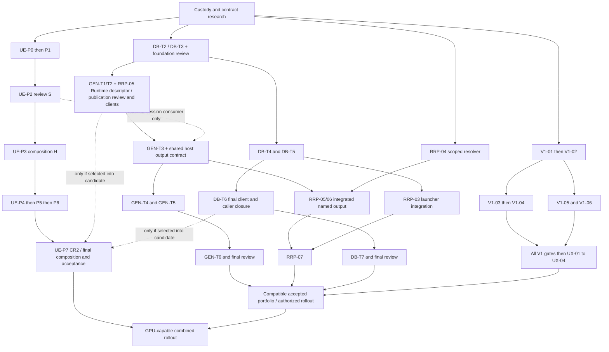

> Frozen reference snapshot. Current state and receiving authority are governed by the package START-HERE and authority.md; preserve the existing live run. Paths below are source references, not missing package requirements.

# Four-project execution plan with Astrid unified-execution handoffs

Current recommendation: keep the four deliverables distinct and coordinate them with the **Astrid unified-execution project**, whose execution-plan label is **`megado-unified-v3`** and current workstream is **P7 CPU closure**, as explicitly corrected by the user. It spans Astrid, Runtime, Reigh app/worker integration and VibeComfy; Reigh is an integration surface, not the project name. Continue its remaining P7 CPU closure and retrieve its accepted source/session/publication handoffs while DB foundation and disjoint V1/RRP work begin after their own authorization/custody gates. Do not restart P0–P3 from the stale wrapper record. New DB/GEN changes enter its current candidate only by a recorded composition decision and affected revalidation.

This current-workstream correction **supersedes the earlier P0-first execution recommendation and historical pending counts as a statement of current progress**. Current P7 status is user-provided; exact current source, receipts, counters and custody remain a handoff verification task. Historical P0–P7 topology below remains useful for provenance and invalidation, not a restart queue. Bounded log discovery found the September 9 setup of `c12-safety-snapshot-20260908/megado-unified-v3`; that confirms handoff identity historically, not current P7 acceptance.

This is GPT Astra medium's planning synthesis, updated 2026-09-10 after discovery of the ratified Astrid unified-execution project. The four Luna reports, original tasklists/review configurations, GPU v3 anchor/idea snapshot/state and targeted sources were checked. No implementation, tests, services, source-custody changes, run-mode changes, or project reviews were performed. The four plans remain dormant; the GPU wrapper's planning failure is distinguished from historical implementation/evidence below. No existing review/oracle counter is consumed by this assessment.

Independent Astra HIGH review later on 2026-09-10 retained this approach and narrowed over-broad handoffs. Start with [orchestrator-brief.md](orchestrator-brief.md) for manager dispatch, custody and ready-set mechanics; [sequencing-review.md](sequencing-review.md) records evidence and disposition. Those clarifications govern the operational reading of older boundary reports. Original run authorities remain unchanged; this portfolio's status statements describe recorded artifacts, not a newly observed live fleet.

## What the four projects deliver

| Project | User-visible improvement | Runtime and data flow | Completion boundary |
|---|---|---|---|
| Database clean break (`DB`) | Fresh realms open predictably; corruption fails closed; backup/replacement has one owner and recoverable interruption states. | Explicit create → exact schema/identity verification → owned writable admission → guarded domain/receipt/CAS transactions → verified WAL/CAS snapshot → verified fresh replacement → catalog/discovery. SQLite, CAS, owner identity and catalog are durable authority. | DB-T7 plus configured final review, covering C1–C8, callers, removals and recovery evidence. |
| Generation alignment (`GEN`) | Successful supported generation calls yield discoverable project generations and ordered variants, including after an async caller exits. | SDK admitted intent → hosted producer → verified named outputs → managed upload → fenced transaction containing objects, generation/variant rows, task completion and receipt → canonical SDK result. Timeline insertion stays explicit. | GEN-T6 plus final review, covering C1–C9 and honestly bounded live coverage. |
| Timeline visualization (`V1`) | Filmstrips show the selected render's real duration, bounded coverage and spoken metadata, with truthful detail/navigation. | Scoped render/run/video/frozen-input selection → admitted visualization → decoded frame clock/cards/audio evidence → managed ZIP/manifest → verified cache rehydration → authored/rendered/cross-view review. | V1-01–06 deterministic gates plus UX-01–04, including the final held-out actor check. |
| Render-path reliability (`RRP`) | The focused project's correct render opens under its proper filename; diagnostics and recovery work through the normal launcher. | Cheap admitted health / explicit offline audit; DB-owned recovery → launcher discovery; scoped render selection → verified managed download → atomic named cache file → exact OS-open request. | RRP-07: full C1–C10 evidence, including the exact Minkhole/Intro regression and truthful opener status. |

The source task definitions are [GEN tasklist](../handovers/generation/tasklist.md), [DB tasklist](../handovers/database/tasklist.md), [V1 tasklist](../handovers/visualization/tasklist.md), and [RRP tasklist](../handovers/render/tasklist.md). Detailed file maps and current-state observations remain in the four sibling research reports; this plan settles how to use them.

The **Astrid unified-execution project** owns Worker → GenericPackHost → engine-neutral ManagedToolSession → checkout/Wan/embedded adapters, with Runtime retaining durable task/lease/settlement authority. `complete-the-astrid-gpu-20260909-1540` is an earlier captured wrapper, not the name or current control state of the P7 workstream. Its [ratified v3 anchor](../handovers/unified-execution/UNIFIED-PLAN-v3.md) supplies historical authority and the historical **22 accepted, one reopened, 22 pending** checkpoint; retrieve the current `megado-unified-v3` handoff before applying any ledger disposition. Preserve P0→P7 order and accepted work. The original snapshot directory is absent here. Wrapper launch errors and fire-19 evidence do not establish current implementation state or acceptance. See [historical GPU assessment](gpu-sequencing-assessment.md), qualified by the current-user correction above.

## Why this execution shape

| Option | Effect | Judgment |
|---|---|---|
| All four fully concurrent | Duplicates recovery and diagnostics; races `service.py`, `store.py`, host publication, SDK invocation and generated clients; independent green suites can refer to incompatible source. | Reject. Parallel investigation and disjoint consumer work are useful; independent ownership of shared authority is not. |
| Full project serialization | Avoids collisions but idles visualization, scoped resolver work and route preparation behind unrelated backup/catalog work. A later generation schema change can still invalidate the earlier database acceptance. | Safe only as a fallback when one worker is available; inefficient as the default. |
| Merge everything into one run | One custody surface, but obscures four user outcomes, hides which criteria failed, and risks replacing already budgeted reviews with a new unbounded program. | Reject. Consolidate duplicated implementation, retain project task and acceptance identities. |
| Hybrid, recommended | One Runtime boundary owner and one Astrid integration owner, with disjoint V1/RRP/adapter lanes released by contracts. Evidence is reused with exact provenance across separate project ledgers. | Best balance of progress, review clarity and low rework. |

Finishing the whole unified-execution project first would idle independent work and risk repeating its final freeze/fire after DB/GEN change the source. Running GPU P2/P6 and GEN-T3 independently would race process lifetime, cancellation, session fencing and spool publication. The recommended hybrid therefore adds a reviewed GPU session/host handoff before combined host integration; it does not make every four-project task depend on live GPU acceptance.

No new mega-run or additional oracle budget is necessary merely to coordinate this portfolio. Use a shared ownership/dependency ledger and the existing run roots. Dispatch workers under the configured project roles; the coordinator schedules, records source identity and routes failures. Existing estimates are provisional human effort, not elapsed duration: DB quotes 6–9 focused days with 10–15 contingency; GEN D1 quotes 5–8 focused engineer-days. Do not add these into a portfolio wall-clock forecast. The serial Runtime/host handoffs and the V1 evidence loop determine elapsed progress more than worker count.

“Owner” below means a project manager stewarding that boundary and assigning leaf workers, not a manager personally implementing every contributing task. DB PM holds Runtime stewardship. Astrid integration custody is a rotating seat among existing PMs, with GPU directing session changes and GEN directing publication changes. Each shared patch has one directing PM/worker; contributing PMs retain separate acceptance criteria and credit the exact shared evidence. A custodian or leaf integrator records/transfers source under that assignment and does not become a sixth project or second task master. Serialize overlapping writes and preserve a stable, identified source during validation.

## Ownership and consolidation

| Shared boundary / exact source | Single implementation owner | Contributing tasks and retained acceptance |
|---|---|---|
| Canonical fresh schema, exact verifier, guarded transaction/receipt/CAS entry: Runtime `runtime_protocol/store.py`, `service.py` | DB Runtime owner. GEN specifies generation semantics; all edits to these files use serial custody. | DB-T2/T3 C1–C3 remain mandatory. GEN-T1/T2 add publication invariants through the same boundary; GEN C1–C4/C8 remain separate. |
| Full verification versus cheap diagnostics: `service.py:272–281,320–329`; verifier in `store.py:2023–2156` | DB Runtime owner implements once; RRP-02 owns responsiveness/offline-audit evidence and operator-facing behavior. | DB verifier coverage is not reduced to satisfy RRP C1/C2. One implementation can satisfy both only with both evidence sets. |
| Replacement, epoch/credentials and catalog truth: `backup.py`, `catalog.py`, `daemon.py` | DB-T4/T5 own the recovery operation and its interruption state machine. | RRP-03 owns launcher invocation/supervision and normal discovery/client proof. No parallel restore/catalog/credential implementation. |
| Settlement output descriptor: `service.py:_stage_outputs` and object publication; protocol schema/template and generated clients | Runtime contract owner, under DB custody, executes GEN-T1/T2 and the Runtime part of RRP-05 in a single serialized contract series. | Port, digest/object, filename, media type, size, ordinal/role and provenance remain distinct; generation envelope is orthogonal to `project.update`. DB client/error parity, GEN atomic publication and RRP filename tests all survive. |
| Host harvest/upload/settle: Astrid `generic_host.py:_typed_outputs`, `_upload_outputs`, settlement; `result_manifest.py` | One Astrid integration writer: GPU P2 owns session/lifecycle changes; GEN-T3 owns the subsequent common publication patch, with RRP-05/V1-06 handoffs. | Combine accepted session and publication contracts once. GPU P7/B04-T05 manifest convergence supplies requirements/acceptance too; no parallel common-manifest implementation. A metadata-only patch can precede the retained-session integration if it preserves the current contract and its limited evidence is explicit. |
| Worker/host ManagedToolSession, engine adapters, warm controls and per-task spool rebind | GPU P2 owns the engine-neutral custody manager; P5/P6 own Wan/embedded retention. GEN and RRP consume it. | Session incarnation/resident key/admission generation are separate from Runtime epoch/lease and GEN generation-row identity. GPU session readiness never replaces DB realm readiness. |
| Astrid `sdk/invocation.py`, `host_bootstrap.py`, `workspace_client.py`, generated client and metadata | Astrid integration owner takes serial file handoffs for DB-T6, GEN-T3, V1-02/06 and RRP-03. | Preserve current dirty work, admission authority, waiting/readback, bootstrap ownership, typed errors and cache outputs. Generated files are produced from one contract revision, never hand-merged. |
| Scoped render selection: `sdk/project_render.py:105–272`, `sdk/timeline_filmstrip.py:197–265` | RRP-04 owns common project/timeline/run/video selection semantics and any narrow reusable selection helper; V1-02 owns filmstrip-specific frozen input and freshness projection. | Both reject foreign/ambiguous media. V1 latest additionally checks current timeline/script freshness; explicit old-run review remains pinned. RRP latest means scoped newest successful render, not V1's stricter freshness policy. |
| Named MP4 cache / ZIP viewer cache: `project_render.py:79–102,273–308`; `invocation.py:1170–1309` | RRP-06 owns video materialization; V1-06 owns bundle verification/rehydration. | Shared invariants and negative fixtures: managed identity, digest+size, safe names, atomic publication, cache is disposable. ZIP member/path verification stays V1-specific. No invented generic cache registry/framework. |
| V1 card/clock/annotation/navigation modules and producer-specific GEN executors | Respective task owner after its contract gate. | Disjoint files can progress concurrently; assignment is by exact file/symbol closure, not just project name. |

This is a recommendation about work ownership, not an assertion that every listed file needs an edit. Reconcile the partial dirty implementation first. In particular RRP's scoped resolver is already present in source, while V1's decoded clock/spoken metadata exist partly in dirty changes; neither has acceptance evidence from these runs. The current synthetic tail is labeled black without pixel proof, and adaptive bounded coverage/resolution work remains outstanding ([V1 report](timeline-visualization.md), sections 2, 3 and 7).

### Recovery and verification decisions

DB-T4/T5 publish one operation contract: verified inactive candidate and source identity; expected prior owner/catalog state; owner stop or typed conflict; replacement switch; fresh credentials/epoch; interrupted-state recovery; and admitted normal-start readiness/discovery. The runtime lifecycle boundary owns authoritative state transitions. RRP-03 drives the launcher through that operation and proves restart, discovery and ordinary client access. The process-control callback or existing launcher seam may live outside the Runtime package, but it must not independently reimplement the durable state machine. RRP-01 and DB-T1 resolve the actual seam before delivery.

Source evidence supports this split: `backup.py:659–732` already materializes an inactive candidate, while `catalog.py:61–125` lacks a lock spanning the full read-modify-write. DB-T4/T5 explicitly own these outcomes (`DB tasklist.md:14–15`); RRP-03 requests a launcher-owned activation path (`RRP tasklist.md:7`). Direct HTTP success from a manually launched realm is insufficient acceptance.

Keep the full read-only verifier at create/open/replacement/snapshot gates. Before writable open, verify a stable private copy including WAL/journal state while exclusive ownership protects the source; only then admit the original. Mutation entry checks admitted state and ownership under the same transaction lock; newly observed integrity/ownership failure revokes readiness. Cheap health/ordinary doctor reports lifecycle state and bounded diagnostics, explicitly distinguishing these from the last full verification report. It must not launch a complete CAS scan under the serving mutex. Deep reinspection operates on a stopped realm or a consistent snapshot, using the same verifier. Any snapshot acquisition barrier is explicit and measured; this plan does not promise zero acquisition cost.

This preserves [DB architecture](../handovers/database/architecture.md) lines 68–90, 106–134 while addressing the actual `health() → doctor() → store._mutex` chain at Runtime `service.py:272–281,320–322`. RRP-02 must prove responsive health, ordinary doctor, read and representative write while a deep snapshot audit is running; DB must prove corrupt input refusal and verification-before-readiness. A cached status alone cannot establish a newly opened realm's integrity.

### Generation's smaller foundation gate and schema/client handoff

GEN does not need DB-T7 completion before implementation. It needs the reviewed DB-T2/T3 foundation, exact schema ownership, and a usable versioned contract/client handoff. GEN-T1 contract research and declarations design should begin with DB-T1 so generation requirements are included in the fresh-format decision. GEN-T1 edits to shared Runtime schema/protocol files are serialized by the Runtime owner; GEN-T2 begins only after DB's foundation review passes.

Do not assume generation requires a new SQL table or that it cannot change schema. Existing `generations` and `generation_variants` are present in the expected schema (`store.py:52–53`), and D1 requires internal primitives and task/group/ordinal identity (`GEN oracle-D1.md:5–17`). GEN-T1 must decide whether existing rows/metadata/constraints enforce that identity, including replay and duplicate-output behavior, or whether exact new constraints/columns are necessary. Record the SQL shape decision separately from the wire envelope version and protocol digest.

Recommended format handoff: DB-T1 and GEN-T1 design one portfolio-target fresh schema before DB-T2 freezes it. If GEN later needs a schema change, the Runtime owner updates the canonical initializer, exact verifier, format identifier and backup/restore expectations together, and reruns affected DB foundation proofs before dependent acceptance. Disposable development fixtures are recreated explicitly for the new exact format. Never weaken exact verification, enable migration-on-open, or silently reinterpret an already frozen format. The final fresh realm is provisioned only after the final portfolio format is accepted. Earlier fixture formats and old real realms remain unsupported/preserved artifacts, not migration targets.

GPU P0/P2 contract inputs join that design: preserve the ratified canonical sha256 object-ID decision and resolve the reopened HC-04 correction without importing its unaccepted diff. Session/capability metadata does not automatically require new SQL tables. Keep GPU ownership/residency descriptors, GEN admitted output intent, wire protocol version and exact DB format distinct; DB's Runtime owner makes any necessary durable changes. F/P/L retain generated-client ownership and include the GPU consumer's protocol/error/fence checks at each changed handoff.

Generated-client scheduling must not create a dependency cycle. GEN-T1 explicitly says “update generated clients as needed” (`GEN tasklist.md:7`); DB-T6 says “regenerate clients once” after DB-T4/T5 (`DB tasklist.md:16`). Interpret the latter as the consolidated DB consumer-closure regeneration, not a global prohibition on producing a client before GEN-T3 can compile or run. At execution, record this cross-plan interpretation explicitly in the delivery ledger; if it is disputed, only the dependent shared-contract work pauses for the configured oracle.

Use these concrete handoffs:

1. **Foundation handoff F:** reviewed DB admission/transaction/verifier contract, exact SQL format revision, retained safety fixtures and immutable source/diff identity. This allows GEN-T2 and DB-T4/T5 work, with shared-file turns serialized.
2. **Publication handoff P:** GEN-T1/T2 envelope, admitted identity/partial rules, settled mapping/errors and RRP-05 filename field are frozen. Generate Runtime and Astrid clients from that protocol revision now; record generator/source/output hashes and demonstrate representative request/response/error parity. GEN publication review must pass before GEN-T3. The host receives usable generated code and fixture examples, not just a prose schema.
3. **Lifecycle/consumer handoff L:** after DB-T4/T5, freeze activation/diagnostic HTTP and launcher contracts; DB-T6 performs one consolidated regeneration/vendoring and caller closure against the current combined contract. If P's revision already contains these operations unchanged, regeneration may simply verify deterministic equality. If it changes, rebuild affected consumers and rerun parity and boundary tests. GEN/V1/RRP integration accepts L's final revision.

There is one generation owner and one revision lineage, not an impossible once-ever generation event. No host/SDK rollout precedes a compatible server/client revision. GEN final acceptance need not wait for unrelated DB documentation, but shared-source acceptance and all portfolio rollout require DB-T6/T7 closure.

### Output identity and render selection decisions

RRP-05 defines filename preservation now; its Runtime descriptor support lands with P before GEN-T3's shared host patch. Current Runtime `_stage_outputs` rejects unknown fields (`service.py:2750–2753`), and publication uses `item['name']` as `original_name` (`service.py:3115–3117`). Updating only the host is therefore insufficient. Keep `name='video'` as port identity; carry a validated basename separately through manifest harvest, upload, settlement, task result and object readback.

CAS deduplication must not make a global object's first filename the authority for every producing task: insertion is currently `INSERT OR IGNORE`. RRP-05 must test two task outputs sharing bytes but declaring different valid names. The selected task's settled filename/provenance determines its materialization name; managed digest determines bytes. Historical `original_name='video'` uses bounded same-task `output_name` evidence, with typed failure if unavailable or conflicting. It must not guess a path, backfill the database or search another project's tasks. Generation uses the same descriptor while task/group/ordinal identity remains independent of filename and attempts.

V1-02 and RRP-04 agree on a common scoped selection result and adversarial cases during research. RRP owns any narrow common helper if inspection justifies extraction; do not mandate a refactor solely because both enumerate runs. V1 retains its frozen envelope/manifest/digest and freshness checks. RRP can implement scoped resolver logic and tests before filename publication is integrated; only RRP-06's final integration depends on RRP-04/05. This is narrower and faster than the research report's suggestion to defer all resolver/materializer work until the entire metadata contract is implemented.

### GPU contract and phase handoffs

The GPU manager owns all seven warm/session operations and four custody modes in v3 lines 29–54. Warm resident identity excludes prompt/seed/resolution/task/output path; GEN task/group/ordinal identity and per-attempt spool remain task-specific. Both the current session admission generation and Runtime lease/epoch must authorize settlement. GPU P2 and GEN-T2/3 must prove the fence-versus-settlement race fails closed, including restart/cancellation after bytes exist. No separate task ledger or digest rewriting is permitted. GPU residency/control failures route to P2/P5/P6, durable admission/publication failures to DB/GEN, and actual field loss to the shared publication writer.

| Producer milestone | Consumer / relationship | Required handoff; current state |
|---|---|---|
| UE-P0 custody, ledger and composition preparation | Joint exchange with DB-T1/GEN-T1/RRP-01 before their affected shared edits | Actual accepted source/diffs, reopened HC-04 disposition, owner map and capability/output/format requirements. This is not UE-P0 completion before independent T1 research, or all T1 completion before disjoint GPU work. P0.c final freeze follows P1–P3 outputs as v3 M1 specifies. **Historical checkpoint; retrieve current P7 acceptance**, no new closure claimed. |
| UE-P1 Vibe merge + independent review | UE-P2; contract prerequisite | Real `cb130f1b` + `5b39fea5` content reconciliation, launch-marker ownership, modern SessionConfig, both profiles. Can run alongside DB and V1 after P0 prerequisites. **Current acceptance: retrieve P7 handoff.** |
| UE-P2 independent review — **S** | GEN-T3 retained-host integration and DB-T6/bootstrap **that consumes session changes**; contract prerequisite | Reviewed manager operations, ownership/capacity descriptors, session/resident/admission identities, spool boundary, CPU fault/fence proofs on exact consumed source; consumer-specific CPU integration evidence is required. Ordinary one-shot/cloud publication and V1/RRP receipt work can precede S on their identified candidate. **Current acceptance: retrieve P7 handoff.** |
| UE-P3 / M1 — **H** | UE-P4 and GPU host/harness composition acceptance | S plus frozen source composition, session-aware harness and executable case inventory; independent observation with Runtime records. Full P3/M1 is mandatory before P4; waiting for H before GEN integration is optional scheduling convenience, not an extra GEN gate. **Current acceptance: retrieve P7 handoff.** |
| UE-P4 checkout lifecycle GPU proof | GEN live checkout coverage; validation prerequisite | Cold/warm/cancel/changed-identity/restart and task-bound output receipts after P0–P3 and reconciled budget. Does not block DB verifier or V1/RRP deterministic work. **Current acceptance: retrieve P7 handoff.** |
| UE-P5 then UE-P6 | Affected GEN-T5 retained Wan/embedded integration; contract + validation prerequisite | Each retains its CPU seam and physical residency gates, per-task spool/cancellation changes and truthful flags. Early fixture/one-shot correctness is a narrower claim. Preserve P4→P5→P6 implementation order. **Current acceptance: retrieve P7 handoff.** |
| DB F/P/L + accepted shared host/GEN changes actually included in GPU candidate | UE-P7; candidate/validation prerequisite | Before final freeze, reconcile changed exact format, clients, settlement, epoch/session fencing and retained producer outputs; run affected CPU proofs. Do not silently replace v3's pinned inputs or demand unrelated V1 UX completion. **Current acceptance: retrieve P7 handoff.** |
| UE-P7 CR2 → final freeze/CPU/GPU/recovery/accounting/independent review | GPU-capable combined rollout; acceptance prerequisite | Preserve B03–B05 producer/deletion obligations and all 45-row evidence classes; zero pods by provider observation. Required for unified-execution project completion, not completion of unrelated V1/RRP work. **Current acceptance: retrieve P7 handoff.** |

This ledger references existing P0–P7 and four-project tasks; it is not another scheduler. GPU source changes after an accepted H or final fire invalidate the affected evidence for the new composition. If the unified-execution project completes on its original accepted composition before these changes, preserve that historical acceptance but do not claim it certifies the later DB/GEN composition. Prefer one final integrated GPU freeze when schedules and existing authority permit it.

Do not add DB F as a blanket UE-P4 prerequisite: v3's verified pinned Runtime `70872d03` candidate can be validated independently. F/P/L gate GPU work only when their changed source/contracts are consumed. Likewise, GPU B04-T05/common-manifest requirements are supplied early to the single publication owner; B04-T05/P7 PASS is not an early GEN-T3 gate. P7 retains its own B03–B05/CR2 obligations. Shared contract availability and later task acceptance are distinct.

## Historical dependency topology — not the current launch order

The earlier wave sketch below explains original dependencies. UE is now at P7 CPU closure per the user, so its earlier rows are contracts/receipts to retrieve, not work to restart. New DB/GEN/V1/RRP tasks follow their own original dependencies. Review gates refer to configured reviews; other handoffs are evidence checks, not extra oracle rounds.

| Wave | Eligible work | Exit / release condition |
|---|---|---|
| 0 — source and contract research | UE-P0 source/ledger/budget research with DB-T1, GEN-T1 research, RRP-01, V1 source/parser census. | Reconcile GPU accepted compositions and missing originals with actual main/isolated custody; shared schema/session/output contract and owners. No wrapper resume or GPU advancement inferred. |
| 1 — foundation and early consumers | UE-P0 completion → P1 in its approved source custody; alongside DB-T2 → DB-T3/RRP-02, GEN-T1 contract edits, V1-01 → V1-02 and RRP-04 in disjoint files. | UE-P1 independent review; DB foundation F; agreed GPU session/GEN envelope requirements; V1-02 identity gate. No whole GPU or DB completion gate. |
| 2 — shared contracts and V1 branches | UE-P2 → P3 in phase order, with one host writer. After F: GEN-T2/RRP-05 Runtime descriptor; DB-T4/T5 scheduled file turns. After V1-02: V1-03/05/06; V1-04 waits for V1-03. | Session S releases retained consumers with exact source/CPU proof; P3/H separately releases GPU P4. GEN publication review/P and DB activation contract release their consumers. V1-local work proceeds on its actual inputs. |
| 3 — host, launcher and consumer closure | GEN-T3 consumes P; retained-session integration also consumes S plus exact code/consumer CPU proof, incorporating RRP-05/V1-06 requirements. Full H is not a blanket GEN/V1/RRP gate. DB-T6 follows T4/T5; RRP-03 consumes DB activation. UE-P4 follows P0–P3 and signed budget on its frozen candidate. | L clients/callers; composed GEN-T3 managed results; V1/RRP deterministic integration. P4 supplies only its stated physical checkout evidence. |
| 4 — adapters and integrated evidence | GEN-T4/T5 in disjoint files after T3; UE-P5 → P6 retains its own order and owns overlapping Wan/Vibe retention patches. DB-T7; V1 UX-01–04 after all implementation/fixture gates; RRP-07 after RRP-02–06. | Separate one-shot/fixture versus retained/GPU evidence; affected GEN-T5 integration consumes P5/P6. All original review budgets and acceptance rows remain. |
| 5 — final acceptance and rollout readiness | GEN-T6 after T4/T5. UE-P7 only after P0–P6, CR2/producer-deletion closure and its final composition gates; incorporate accepted DB/GEN changes if selected for that composition. | Four ledgers plus unified-execution project's separate final evidence for GPU claims. No demand for GPU P7 before unrelated four-project completion; no reuse of an old fire to certify changed source. |

The actual V1 dependency is decisive: V1-01 → V1-02 → V1-03 → V1-04; V1-05 and V1-06 branch after V1-02 (`V1 tasklist.md:5–10`). Option/fixture research may overlap V1-03, but V1-04 implementation must consume accepted overview/coverage semantics. Some research prose proposed parallel option implementation; the original tasklist takes precedence.

The diagram omits per-file custody and some client edges; the tables govern them. Retained host integration combines DB F → GEN P with GPU P0 → P1 → S; P3/H separately gates GPU P4. GPU physical phases and producer/deletion closure can dominate GPU-capable rollout, while V1/RRP remain independently finishable. GEN's affected retained adapters consume P5/P6; conditional final-composition edges require consumed contracts and affected evidence, not whole GEN-T6/DB-T7 or unrelated V1 UX completion. Starting disjoint work early reduces idle time; adding shared-file writers does not.

## Evidence, reviews and failure routing

Every handoff records repository path, branch/HEAD, dirty patch or content hashes, contract/schema revision, task IDs, exact commands and result artifact locations. A dependent task cites that handoff and its consumed revision. Existing tests or dirty source are not PASS evidence. Reuse a shared test execution across projects only when the fixture, assertion and exact source satisfy both criteria; retain distinct acceptance rows. Run focused boundary checks at handoffs, then each required broad suite on its integrated candidate; batch identical commands when candidate/source are truly identical and rerun affected checks after changes.

| Acceptance owner | Required handoff evidence / review preserved |
|---|---|
| DB | F proves exact schema, read-only refusal, exclusive ownership, transaction admission, atomic receipt/domain rollback and CAS recovery. DB-T4/T5 prove WAL/CAS replacement, original retention, fresh credentials/epoch, interruptions and full catalog RMW. DB-T6/T7 prove real positive domain behavior, typed errors/client parity, compatibility removal and operator guidance. `DB run.yaml:15–31`: foundation after T3, max 2 rounds; final after T7, max 3 rounds. |
| GEN | P proves task/group/ordinal identity, admitted partial policy, verified output authority, atomic objects/domain/task/receipt publication, crash/replay/conflict/stale/cancel failure behavior, preserved project.update and non-generation control. GEN-T3 proves sync wait and caller-exited async managed-media readback; T4/T5 prove all retained route contracts. `GEN run.yaml:14–30`: publication review after T2, max 2 rounds; final after T6, max 3 rounds. Provider/GPU execution remains separately bounded by existing authorization. |
| RRP | RRP-02 C1/C2 consumes full DB verifier proof plus its responsiveness/offline tests. RRP-03 consumes DB recovery proof plus normal-launcher restart/discovery/CLI proof. RRP-04–06 prove wrong-global-project rejection, safe scoped filename, media type, digest/size on download and reuse, atomic cache and exact opener request. RRP-07 proves the named regression and removals. `RRP run.yaml:10–12` has max 3 oracle calls and no currently configured stages; `status.md:12–14` requests selecting stages by coupling at delivery. Record that choice once; recommend shared DB/GEN boundary review evidence with RRP's own criteria rather than an automatic extra series. |
| V1 | All V1-01–06 deterministic tests must pass before UX-01, even though the tasklist explicitly lists only V1-06 as its dependency. This closes the acceptance coverage gap without weakening any task order. A real decodable five-minute dual-view fixture, two render byte identities, hidden truth, tail/fast cuts, shotless speech and prompt traps plus actual image capture are prerequisites. Preserve UX baseline → one Astra round → precise fixes → fresh replay → second Astra round → precise fixes → fresh held-out check. No third hidden critique. |

V1 `run.yaml:10–17` retains two remaining centrally accounted oracle calls and, separately, two capped delivery UX invocations explicitly **not oracle calls** (`agent_goal.md:7`); `test-project.md:19–30` requires real viewed-image evidence and marks missing capture undetermined. Follow those existing accounting rules when execution is authorized. This portfolio synthesis is external planning and is neither UX round nor execution completion review. DB/GEN/RRP budgets are likewise preserved, including any already consumed calls; do not reset counters when consolidating tasks.

GPU preserves v3's Sol implementation/independent-review routing, Luna adapters/harness/evidence and implementer-independent Sol final review. No counters or historical acceptance are reset. Its aggregate USD 6 cap includes prior fires; spend/attempt reconciliation precedes new GPU work, with one pod, at most two live attempts per engine/profile cluster, three-hour pod cap, 4 GiB free floor, 2 GiB generated evidence cap, no model downloads and provider-observed cleanup. A GEN smoke on that unified-execution project cannot become an unaccounted extra fire. Full constraints and missing evidence are in the GPU assessment.

Failures route by broken authority:

- Schema/verifier/admission/receipt/CAS or generated protocol defect → Runtime owner, with DB foundation and affected GEN/RRP evidence invalidated. Pause only dependent shared integration; disjoint V1/adapter research continues.
- Replacement, credentials, epoch or catalog defect → DB-T4/T5. Normal launcher process identity/discovery consumption defect with a sound operation → RRP-03. A direct-HTTP workaround is not resolution.
- Output field lost at harvest/settle → publication owner under GEN-T3/RRP-05. Wrong adapter groups/provenance → GEN-T4 or T5. Never repair a host contract separately inside each producer.
- Wrong common scope/run/video selection → RRP-04 owner with both consumer regressions; filmstrip frozen freshness, clock, coverage or spoken annotation → V1 task owner. Cache ZIP membership → V1-06; MP4 naming/opener → RRP-05/06.
- Routine clear defects use the configured normal correction route. Contested format/ownership decisions go to the existing designated oracle with concrete alternatives and evidence; retain budget and unaffected results. Missing execution authority, unresolved main-source custody, missing live target or missing visual capture is an explicit outstanding condition, never a synthetic PASS.

## Custody, first tranche and rollout order

The recorded Astrid source is dirty `main` at `82d09bb91c8a4621695c1d8b6966652cad941ef4`; recorded Runtime source is dirty `codex/canonical-timeline-replacement-20260909` at `afccb430e2a983c968b6a8a96fd630ba3a6262fc`. These are observed research locations, not new delivery permission. V1 additionally has a selected dirty patch whose digest is recorded in [its report](timeline-visualization.md); reconstructing from HEAD alone loses required input.

DB's explicit user amendment says existing main, no branches/worktrees, preserve dirt and resolve Runtime main-source location before editing (`DB agent_goal.md:11–13`). GEN-T1 requests isolated custody (`GEN tasklist.md:7`). For shared DB/Astrid source, recommend honoring the explicit user amendment with serial file custody and per-task immutable diffs; generation's isolation can be task/diff ownership there, rather than a newly created worktree. This recommendation does not silently amend the generation run or establish which Runtime main directory is authoritative. Wave 0 must reconcile the real Git worktree inventory, dirty origins and project instructions; if evidence does not resolve the authority, bring that precise unresolved location/interpretation to the configured decision owner before shared edits. Do not switch a dirty feature checkout to main or transplant uncommitted work implicitly.

The DB amendment is scoped to its owning Runtime and Astrid closure. GPU v3's isolated-clean-worktree rule, particularly P1 Vibe integration, also stands. Do not apply DB's rule to Vibe/Reigh/Worker or silently apply GPU isolation to DB. Shared Astrid/Runtime artifacts require a recorded source-transfer/integration decision and serial write ownership; until both mandates can be honored, defer conflicting edits and progress disjoint work. GPU-owned Reigh producer/deletion work remains inside that program, outside the four deliverables. All source remains read-only during this assessment.

The concrete current first execution tranche, after applicable delivery authorization, is:

1. Recover the current **Astrid unified-execution / megado-unified-v3 / P7 CPU closure** manager handoff: remaining original CPU rows, accepted S/H/protocol/manifest evidence, exact multi-repo source and custody, CR2/freeze status, review counters and remaining live allowance. Preserve its current work; do not restart the old wrapper. In parallel, DB-T1, GEN-T1, RRP-01 and V1 source reconciliation identify their own inputs/write sets.
2. Continue UE's ready P7 CPU closure on its accepted candidate. On separate available source, progress DB-T2→T3, V1-01→02 and RRP-04 after RRP-01. Prepare GEN publication/fence fixtures and the V1 video/hidden truth. No paid work is implied by this CPU tranche.
3. Reuse evidenced UE S/H in the chosen shared-host baseline; after F, complete GEN-T2 and publication review P, then release affected GEN-T3 integration with exact consumer CPU proof. Schedule any P7-manifest/GEN-publication overlap once under one PM. DB-T4/T5 and V1-03/05/06 continue on their prerequisites. Incorporate new DB/GEN changes into UE deliberately, preserving historical acceptance and rerunning affected checks for the changed candidate.

Implementation/integration order and rollout order differ. Converge F → P and GPU P0 → P1 → S for retained host consumers; finish P3/H before GPU P4 and incorporate DB consumer closure L where its changes are consumed. Preserve GPU P4→P5→P6→P7 and choose which compatible candidate its final freeze certifies. In a shared main checkout, “integrate” means a controlled recorded source handoff; it does not imply an authorized commit or push. GPU's own tracked-source/push completion obligations remain in its existing program.

For a future authorized rollout, accept the combined exact SQL format and Runtime/server/client versions first, preserve existing roots/backups, explicitly provision a fresh development realm, then prove normal launcher/bootstrap access before enabling dependent host/SDK flows. Run fresh fixture publication/open/filmstrip checks on the integrated version; only then perform separately authorized real-target or paid provider smokes. No live corruption repair, old-backup migration or automatic real-data cutover is implied.

One important rollout limitation must remain visible: DB makes old realms/backups unsupported, while RRP-07 names a historical Minkhole artifact. The exact regression can be specified with its frozen identity and exercised with disposable scoped fixtures, but claiming the original 11,288,161-byte artifact was opened requires the actual verified bytes and authorized managed Runtime access. Do not migrate the old realm or fake that proof to satisfy the portfolio schedule. Retain the historical fixture/real-artifact distinction and report the exact real-artifact gate outstanding if access is unavailable.

Adjacent artifact lifecycle work remains separate. E2-01–05 can develop against a synthetic producer, subject to the same shared-file contracts if later authorized; E2-06 waits for accepted V1 and E2-03/E2-04 (`ephemeral-derived-artifact-lifecycle tasklist.md:5–10`). Share output role/provenance vocabulary now, but do not add leases, TTL, promotion, deletion, new event families or lifecycle storage to these four deliverables. Its downstream integration must not become a prerequisite that blocks V1 or GEN.

The next execution decision is source custody and authorization for this coordinated CPU tranche. The four deliverables retain their own acceptance; the Astrid unified-execution project supplies accepted session/host contracts and later physical proof without becoming a blanket prerequisite for all work. This plan and the linked assessments are planning artifacts, not run authorization or execution evidence.
