# 02 — Reigh Task Pipeline: End-to-End Trace (PostgreSQL + edge functions + orchestrators)

## 1. Summary

Reigh's task pipeline is a **poll-based, pull model** built on Supabase (Postgres) as the single
source of truth. A user action in the Next.js frontend (`reigh-app`) posts to the **`create-task`**
edge function, which inserts one or more rows into `public.tasks` (`status='Queued'`). There is **no
push/queue broker**: both the GPU workers (`reigh-worker`) and the API orchestrator
(`reigh-worker-orchestrator/api_orchestrator`) poll Supabase edge functions (`task-counts`,
`claim-next-task`) on fixed intervals, and an atomic SQL RPC (`claim_next_task_service_role`) flips a
Queued row to `In Progress` and stamps `worker_id` + claim-time route decision columns. The GPU
"orchestrator" (`gpu_orchestrator/control_loop.py`) is a **capacity manager, not a scheduler**: it
counts claimable tasks via the `task-counts` edge function, spawns/terminates RunPod workers, health
checks them, and resets orphaned/stale tasks. Workers report completion by uploading output to Supabase
Storage (signed URLs) and calling the **`complete_task`** edge function, which updates the task row,
creates a `generations` row, and fires billing. Credits are **deducted only at completion**
(`calculate-task-cost` edge → `credits_ledger` spend entry → `users.credits` recomputed by trigger).
Real-time client updates flow through the `supabase_realtime` publication (`postgres_changes` on
`tasks`/`generations`/`shot_generations`/`generation_variants`/`timelines`). There is no per-task
email/push/webhook notification; the only notification-adjacent machinery is a pg_cron job that posts
daily Discord stats and a balance-trigger auto-topup path. Retries are bounded by a `tasks.attempts`
counter (max 3), enforced in four independent places: worker-side requeue (retryable error classes),
heartbeat crash recovery, orchestrator orphan resets, and a pg_cron `auto_fail_stale_tasks` sweep.

**Key facts**
- **Current schema location**: `reigh-app/supabase/migrations/` (the top-level `supabase/functions/`
  is an empty husk — the ~3-month-old copy; `reigh-app/supabase/functions/` is the live edge-function
  tree). `reigh-app/supabase/config.toml` sets `verify_jwt = false` for all task functions.
- **Task status enum** (`public.task_status`, migration `20250100000000_create_base_schema.sql:4`):
  exactly `Queued`, `In Progress`, `Complete`, `Failed`, `Cancelled`. No other values were ever added
  (`ALTER TYPE` search shows only `credit_ledger_type` gained values).
- **Status transition allowlist** is enforced in the `update-task-status` edge function:
  `Queued → {In Progress, Failed, Cancelled}`, `In Progress → {Complete, Failed, Cancelled, Queued}`,
  terminal states are final (`reigh-app/supabase/functions/update-task-status/transitions.ts`).
- **Task creation**: `POST /functions/v1/create-task` with `{family, project_id, input}`; resolvers
  per family produce 1..N `TaskInsertObject`s, each stamped with a route contract
  (`route_key`, `params.route_contract`) before insert
  (`create-task/index.ts:507-521`, `create-task/routeContract.ts:107-127`).
- **Claiming**: `POST /functions/v1/claim-next-task` → RPC `claim_next_task_service_role(...)` —
  one atomic `UPDATE tasks SET status='In Progress', worker_id, generation_started_at, claimed_*`
  ordered by model-affinity then `created_at` (`claim-next-task/index.ts:120-172`,
  `20260507215500_respect_task_selector_namespace_in_claims.sql:228-330`).
- **Polling cadence**: GPU worker `--poll-interval` default **10 s**
  (`reigh-worker/source/runtime/worker/server.py:231`); API orchestrator `API_PARENT_POLL_SEC`
  default **10 s** (`api_orchestrator/main.py:130`); capacity orchestrator `ORCHESTRATOR_POLL_SEC`
  default **30 s** (`gpu_orchestrator/config.py:120`, `main.py` continuous loop).
- **Worker selection**: workers self-select by pulling claims; a worker's backend
  (`wgp`/`vibecomfy`), selector namespace, profile, and contract version are sent in the claim
  payload and matched against live `route_backend_selectors`/`route_backend_capabilities` rows
  (`20260506110000_add_route_backend_selector_control_plane.sql:179-330`).
- **Concurrency**: per-user cap of **5** `In Progress` tasks (claim RPC `HAVING COUNT(...) < 5`);
  API orchestrator `API_WORKER_CONCURRENCY` default 20 (code) / 50 (checked-in `.env`).
- **Billing**: single spend entry per task in `credits_ledger` (`type='spend'`, negative amount),
  computed from `generation_started_at → generation_processed_at` duration × `task_types`
  billing config; default fallback rate 0.0278/s; idempotent (skips if spend exists).
- **No automatic refunds** for failed tasks: `refund` exists in the `credit_ledger_type` enum but no
  code path inserts it (likely manual/Stripe-level). Cancelled orchestrators are billed only for
  completed segments.
- **Dead-letter / terminal fallbacks**: orchestrator orphan resets (15/30 min), heartbeat crash
  recovery, pg_cron `auto_fail_stale_tasks` (In Progress >24 h → Failed; Queued with failed
  dependency → Failed), route sentinel `sentinel_ticks` every minute.

---

## 2. End-to-End Lifecycle (numbered)

1. **User action → create-task (frontend)**. `reigh-app/src/shared/lib/taskCreation/createTask.ts`
   POSTs `{family, project_id, input, idempotency_key}` to `/functions/v1/create-task` (retries once
   on timeout). Call sites: `useVideoEditing.ts` (`edit_video_orchestrator`),
   `submitSegmentTask.ts` (`individual_travel_segment`), `useImg2ImgMode.ts` (`z_image_turbo_i2i`),
   `useMagicEditMode.ts` (`magic_edit`/`klein_edit`), `useUpscale.ts` (`image_upscale`),
   `useVideoEnhance.ts` (`video_enhance`), `createInpaintingTaskWorkflow.ts` (`masked_edit`),
   `ImageGenerationModal.tsx` (`image_generation`).
2. **create-task resolves + inserts** (`create-task/index.ts:410-523`). Auth (JWT/PAT/service-role)
   → project ownership check → family resolver builds 1..N `TaskInsertObject`s (status `Queued`) →
   each is stamped with route contract (`stampTaskRouteContract`, RPC `derive_route_key`) → `INSERT
   INTO tasks` (one by one; unique `idempotency_key` dedupe on 23505 returns the existing task).
   Resolver examples: `individualTravelSegment.ts` (segment), `travelBetweenImages.ts` (orchestrator
   + segment + stitch chain), `editVideoOrchestrator.ts` (single orchestrator row),
   `workerPassthrough.ts` (worker-created child tasks, honors pre-generated `task_id`).
3. **Row enters queue**. `tasks.status='Queued'`, `created_at` set; triggers fire: no-op realtime
   broadcast trigger (`20250127000006_remove_broadcast_http.sql`), realtime publication sends the
   INSERT to the client channel `task-updates:<project_id>`
   (`reigh-app/src/shared/realtime/RealtimeConnection.ts:192-257`).
4. **Capacity discovery (GPU orchestrator)**. `gpu_orchestrator/control_loop.py` every
   `ORCHESTRATOR_POLL_SEC` (30 s) calls `get_detailed_task_counts_via_edge_function()` →
   `task-counts` edge (RPC `count_queued_tasks_breakdown_service_role`) and uses
   `potentially_claimable = queued_only + blocked_by_capacity` for scaling
   (`control_loop.py:139-204`).
5. **Worker poll + claim**. GPU worker loop (`server.py:841-862`) calls `poll_next_task` every
   10 s: `task-counts` gate → `POST claim-next-task` (payload includes `worker_id`, `run_type=gpu`,
   `same_model_only=true`, `max_task_wait_minutes=5`, backend/profile/selector/contract fields)
   (`reigh-worker/source/core/db/task_claim.py:341-415`). The edge function calls
   `claim_next_task_service_role`, which atomically picks the oldest eligible Queued task (deps
   complete, user credits>0, cloud enabled, <5 in progress, route eligible) and **UPDATEs the tasks
   row to `In Progress`** with `worker_id`, `generation_started_at`, `claimed_backend`,
   `claimed_selector_namespace`, `claimed_route_key`, `claimed_selector_version`,
   `claimed_capability_version`, `claim_decision_reason`, `claim_decision_snapshot`
   (`20260507215500_...sql:228-330`). API orchestrator does the same with `run_type=api`
   (`api_orchestrator/task_utils.py:claim_next_task`), with phantom-claim recovery on timeout
   (queries `tasks` In Progress + worker_id, `task_utils.py:96-149`).
6. **Worker executes**. GPU: `process_single_task` through `source/task_handlers/` (Wan/WGP
   generation, travel orchestrators, join clips, etc.). API: `process_api_task` dispatches to
   `api_orchestrator/handlers/{fal,wavespeed,image,banodoco}.py`. Worker sends heartbeats every
   20 s via guardian subprocess → RPC `func_worker_heartbeat_with_logs` (updates `workers` row,
   inserts `system_logs` batches; crash recovery when `status_param='crashed'`)
   (`reigh-worker/source/runtime/worker/guardian.py:79-163`, `20260331060000_add_crash_recovery_to_heartbeat.sql`).
7. **Output upload**. Worker completes generation locally, then either base64-post or signed-URL
   upload: `generate-upload-url` edge creates signed upload URL (1 h expiry, storage path
   `user/<uid>/tasks/<task_id>/...`) for files ≥2 MB (`FILE_SIZE_THRESHOLD_MB = 2.0`,
   `source/core/db/lifecycle/task_status_complete_local.py:20`, `generate-upload-url/index.ts`).
8. **Completion report**. Worker POSTs `complete_task` (or `update-task-status` with
   `output_location` for URL-only cases, `api_orchestrator/task_utils.py:151-203`).
   `complete_task/handler.ts` performs (in order): task-actor auth → storage-path security check →
   rate limit (non-service-role) → storage ops (public URL) → params follow-up updates → **create
   generation** (INSERT `generations` + `shot_generations`/`generation_variants` wiring via
   `generation.ts` / `generation-handlers.ts`, or DB trigger fallback) → **UPDATE tasks
   SET status='Complete', output_location, generation_processed_at WHERE id=? AND
   status='In Progress'** (concurrency guard) → `cleanupMaterializedInputs` → orchestrator
   completion check → billing trigger → follow-up issue persistence
   (`complete_task/handler.ts:304-460`).
9. **Billing**. `complete_task` fires `calculate-task-cost` edge (service-role). It computes
   duration (or sums sub-task durations for orchestrators), skips sub-tasks (parent billed),
   **INSERTs `credits_ledger`** `{user_id, task_id, amount: -cost, type:'spend', metadata}` (skips if
   a spend already exists) → `refresh_user_balance` trigger recomputes `users.credits`
   (`calculate-task-cost/index.ts:150-335`, `20250113000000_add_credits_system.sql:35-52`).
10. **Client update**. Realtime publication delivers the tasks/generations UPDATE/INSERT to the
    client (`RealtimeConnection.ts:249-296`); React Query invalidates task queries. Client also has
    `tasks-list`, `get-task-status`, `get-task-output`, `task-status` (GET, projects
    `result_data` envelope) reads.
11. **Orchestrator cleanup / next cycle**. GPU orchestrator phases: spawn/health/cleanup, orphan
    reconciliation (`reset_orphaned_tasks`, `reset_unassigned_orphaned_tasks`,
    `reset_stale_assigned_tasks`, `control_loop.py:767-796`), scaling decision, periodic checks —
    every 30 s cycle (`control_loop.py:86-124`).

```mermaid
stateDiagram-v2
    direction LR
    [*] --> Queued : create-task edge (INSERT tasks, status default Queued)
    Queued --> In_Progress : claim RPC (atomic UPDATE; worker_id + claimed_* stamped)
    Queued --> Cancelled : update-task-status (user cancel) / cascade
    Queued --> Failed : cascade / auto_fail_stale_tasks (dep failed) / update-task-status
    In_Progress --> Complete : complete_task edge (WHERE status='In Progress')
    In_Progress --> Queued : worker requeue (retryable error) / orchestrator orphan reset / heartbeat crash (attempts<3)
    In_Progress --> Failed : worker mark failed / complete_task failure / crash at attempts>=3 / stale >24h cron / orchestrator segment gate
    In_Progress --> Cancelled : update-task-status (user cancel, incl. orchestrator subtasks)
    Complete --> [*]
    Failed --> [*]
    Cancelled --> [*]

    note right of In_Progress
      attempt cap = 3 (tasks.attempts);
      enforcers: worker retry policy,
      heartbeat crash RPC, orchestrator
      resets, 24h cron
    end note
```

---

## 3. Per-Step DB Writes (table + columns) and Owner

| # | Step | Writer (component) | Table | Columns written | Notes |
|---|------|--------------------|-------|-----------------|-------|
| 1 | Task creation | `create-task` edge (service-role client) | `tasks` | `project_id`, `task_type`, `params`, `status='Queued'`, `created_at`, `dependant_on`, `idempotency_key`, `materialized_inputs`, `copied_from_share`, `route_key`, `selector_namespace`, `selected_backend`, `selector_version`, `route_selection_snapshot`, `id` (worker pre-generated for children) | insert per task; 23505+idempotency_key → dedupe (returns existing) |
| 2 | Claim | `claim_next_task_service_role` RPC (called by `claim-next-task` edge) | `tasks` | `status='In Progress'`, `worker_id`, `updated_at`, `generation_started_at`, `claimed_backend`, `claimed_selector_namespace`, `claimed_route_key`, `claimed_selector_version`, `claimed_capability_version`, `claim_decision_reason`, `claim_decision_snapshot` | single atomic UPDATE; no lease column — liveness = heartbeat + resets |
| 3 | Worker register/heartbeat | `func_worker_heartbeat_with_logs` RPC (guardian subprocess, every 20 s) | `workers` | `last_heartbeat`, `metadata` (vram_*), `status` (`active`/`crashed`); auto-INSERT `(id, instance_type='external', ...)` if missing | crash path also writes `tasks` (see #9) |
| 3b | Heartbeat log batch | same RPC | `system_logs` | `timestamp`, `source_type='worker'`, `source_id`, `log_level`, `message`, `task_id`, `worker_id`, `metadata` | batch insert; cleanup cron deletes >48 h |
| 4 | API worker registration | `api_orchestrator/database.py:register_worker` | `workers` | upsert `id`, `instance_type='api'`, `status='active'`, `last_heartbeat`, `metadata`, `created_at` | heartbeat refreshed every 3rd loop (`main.py:191-195`) |
| 5 | Completion: generation | `complete_task` edge (`generation.ts`) or DB trigger `create_generation_on_task_complete` (AFTER UPDATE WHEN status='Complete', `20250910000011`) | `generations` (+`shot_generations`, `generation_variants`) | `project_id`, `tasks` jsonb, `params`, `location` (public URL), `type`, `created_at`; shot/generation join rows | edge path gated by env `CREATE_GENERATION_IN_EDGE !== 'false'`; DB trigger sets `tasks.generation_created=true` |
| 6 | Completion: task row | `complete_task` edge | `tasks` | `status='Complete'`, `output_location` (or `outputLocationOverride`), `generation_processed_at` | guarded by `.eq('status','In Progress')` — lost-race writer falls through |
| 6b | Completion: params follow-up | `complete_task` edge | `tasks` | `params` (thumbnail URL injection, invalid shot_id cleanup) | best-effort; failures recorded in result_data |
| 6c | Completion: follow-up issues | `complete_task` edge | `tasks` | `result_data.completion_follow_up` (`{status:'degraded', recorded_at, issues[]}`) | only when issues exist |
| 7 | Failure at completion | `complete_task` (`markTaskFailed`) / `update-task-status` | `tasks` | `status='Failed'`, `error_message`, `updated_at` (markTaskFailed restricts to `status IN (Queued, In Progress)`) | `complete_task/completionHelpers.ts:83-97` |
| 8 | Orchestrator completion | `complete_task` (`orchestratorCore.ts`) | `tasks` (orchestrator row) | `status='Complete'|'Failed'`, `generation_started_at` (earliest sub-task start), `generation_processed_at`, `output_location` (final-step only), `error_message` (fail) | gate: expected segment count vs siblings; `.in('status', ['Queued','In Progress'])` |
| 9 | Crash recovery | `func_worker_heartbeat_with_logs` (status='crashed') | `tasks` | attempts<3: `status='Queued'`, `worker_id=NULL`, `generation_started_at=NULL`, `attempts+=1`, `error_message`; attempts>=3: `status='Failed'`, `worker_id=NULL` + `cascade_task_failure(...)` | `20260331060000_add_crash_recovery_to_heartbeat.sql:39-120` |
| 10 | Orphan resets | `gpu_orchestrator/database.py` (every cycle) | `tasks` | `status='Queued'`, `worker_id=NULL`, `generation_started_at=NULL`, `generation_processed_at=NULL`, `error_message`, `attempts` (API path only) | filters: attempts<3; see §6 |
| 11 | Billing | `calculate-task-cost` edge | `credits_ledger` | `user_id`, `task_id`, `amount` (negative), `type='spend'`, `metadata` (task_type, duration, rates, breakdown) | idempotency: skip if spend for task exists |
| 11b | Balance refresh | trigger `credits_ledger_after_insert/update/delete` | `users` | `credits` (recomputed SUM of ledger) | direct `users.credits` writes blocked by `prevent_credit_manipulation` |
| 12 | Capacity intent (reconciler variant only) | `gpu_orchestrator` (capacity-reconciler repo) | `worker_capacity_intents`, `worker_capacity_route_backoffs`, `orchestrator_leases` | pool/route/capacity/reason/actions/outcome; backoff counters; lease key/holder/expiry | schema `sql/20260514000000_create_worker_capacity_intents.sql` |
| 13 | Worker status transitions | `gpu_orchestrator` (`update_worker_status`, terminates) | `workers` | `status` (`spawning`→`active`→`error`/`terminated`), `metadata` (error_reason, error_time, pod_id) | `database.py:381-420`, control loop phases |
| 14 | Sentinel tick | pg_cron → `route-contract-sentinel` edge | `sentinel_ticks` (+ `pause_scaling`) | `ts`, state classification (`OK|NO_WORK|UNCLAIMABLE_WORK|NO_READY_WORKERS|WORKERS_STUCK_INITIALIZING`) | every minute; `20260513120300_sentinel_infra.sql` |
| 15 | Auto-fail sweep | pg_cron `auto_fail_stale_tasks` (every 5 min) | `tasks` | `status='Failed'`, `error_message`, `updated_at` | In Progress >24 h; Queued with Failed/Cancelled dependency |

No task state is stored anywhere except the `tasks` row (plus derived `generations`/`credits_ledger`
rows and `system_logs`). There is **no separate queue table, no broker, no lease table** in the
current tree (the capacity-reconciler variant adds `orchestrator_leases`, but that leases
orchestrator *cycles* for split-brain protection, not tasks).

---

## 4. Status Enum + Transition Rules

Enum (Postgres): `CREATE TYPE public.task_status AS ENUM('Queued', 'In Progress', 'Complete', 'Failed', 'Cancelled')`
(`20250100000000_create_base_schema.sql:4`); column `tasks.status` default `'Queued'`, NOT NULL.

Enforced transition allowlist (edge `update-task-status/transitions.ts`):

| Current | Allowed next |
|---|---|
| `Queued` | `In Progress`, `Failed`, `Cancelled` |
| `In Progress` | `Complete`, `Failed`, `Cancelled`, `Queued` (requeue) |
| `Complete` | — (terminal) |
| `Failed` | — (terminal) |
| `Cancelled` | — (terminal) |

Notes:
- `validateStatusTransition` rejects others with HTTP 409 (`statusValidation.ts`).
- A `reset_generation_started_at`-only call (In Progress→In Progress with `reset_generation_started_at=true`)
  bypasses the transition check (used by workers to reset billing start time, `index.ts:86-101`,
  `task_status.py:696-707` worker side).
- `update-task-status` writes: always `status`, `updated_at`; `generation_started_at` on
  In Progress; `generation_processed_at` on Complete; `output_location`, `attempts`,
  `error_message` (=`error_details`), `worker_id=NULL`+`generation_started_at=NULL` on
  `clear_worker=true`; `result_data` when supplied (`payload.ts`).
- DB-side writers (claim RPC, heartbeat crash RPC, orchestrator resets, cron, cascade RPC) bypass
  the edge allowlist but follow the same statuses; `cascade_task_failure` writes `Failed` or
  `Cancelled` to any non-terminal related task (`20260331040000_add_cascade_failure_rpc.sql`).
- Timing-field protection: `prevent_timing_manipulation_trigger` blocks non-service-role /
  non-`claim_task`/`complete_task` writes to `generation_started_at`/`generation_processed_at`
  (`20250113000003_protect_timing_fields.sql:66-96`).

---

## 5. Task Payload Schema (`tasks.params` JSONB + row columns)

`params` is free-form JSONB; shape is defined per family by the resolvers and worker contracts. The
`create-task` `TaskInsertObject` (`create-task/resolvers/types.ts:31-64`) shows every writable row
column: `id`, `project_id`, `task_type`, `params`, `status`, `dependant_on (uuid[])`,
`worker_id`, `attempts`, `error_message`, `result_data`, `output_location`,
`generation_started_at`, `generation_processed_at`, `generation_created`, `idempotency_key`,
`materialized_inputs`, `copied_from_share`, `route_key`, `selector_namespace`, `selected_backend`,
`selector_version`, `route_selection_snapshot`, `support_state`, `selected_profile`,
`selected_template_id`, `route_run_id`, `worker_contract_version`.

Common `params` field sets (evidence):

- **Route contract block** (stamped at create; `create-task/routeContract.ts:38-62`,
  `_shared/selectedRoute.ts`): `params.route_contract = {route_key, selector_namespace,
  selected_backend, selector_version, route_selection_snapshot, support_state, selected_profile,
  selected_template_id, route_run_id, worker_contract_version, derived_at, derived_by,
  derive_route_key_version}`.
- **Orchestrator linkage** (all sub-tasks): `params.orchestrator_task_id_ref |
  params.orchestration_contract.orchestrator_task_id | params.orchestrator_task_id |
  params.orchestrator_details.orchestrator_task_id | params.originalParams.orchestrator_details.orchestrator_task_id`
  (canonical + legacy refs read by billing & cascade, `_shared/billing.ts:extractOrchestratorRef`,
  `cascade.ts:16-28`, `20260331040000_add_cascade_failure_rpc.sql:20-29`).
- **Orchestrator task** (`editVideoOrchestrator.ts:22-39`): `{orchestrator_details, tool_type?,
  parent_generation_id?, based_on?}`; travel orchestrator carries `original_common_args`
  (`poll_interval`, `poll_timeout` — defaults 15 s / 1800 s, `task_handlers/travel/orchestrator.py:2364-2367`)
  and full orchestration payload.
- **Generation task** (e.g. `individual_travel_segment`): `{prompt(s), model_name, seed, aspect,
  resolution, shot_id, generation_id, based_on, run_id, image_url/input images, loras,
  hires_fix, add_in_position, num_generations, ...}`; worker injects `params.task_id` and
  `params.orchestrator_details.orchestrator_task_id` at runtime (`server.py:900-905`).
- **Worker-supplied result envelope** (banodoco + status readers): `result_data` row column carries
  `{correlation_id, message, failure_code, config_version, timeline_id, ...}` projected by the
  `task-status` GET handler (`task-status/handler.ts:76-105`).
- **Materialized inputs** (`tasks.materialized_inputs`): `[{generation_id, kind:'file'|'remote',
  target}]` — local-only generation inputs uploaded on demand (`20260505012055_add_materialized_inputs_to_tasks.sql`).

`task_types` (joined by FK `tasks.task_type → task_types.name`,
`20260213000000_add_tasks_task_type_fkey.sql`) supplies per-type contract columns used downstream:
`run_type` ('gpu'|'api'), `category` ('generation'|'processing'|...), `tool_type`, `content_type`,
`variant_type`, plus billing config (`billing_type`, `base_cost_per_second`, `unit_cost`,
`cost_factors`).

---

## 6. Retry / Timeout / Lease Parameters (exact values)

All values below are code defaults unless marked "prod .env" (from `reigh-worker-orchestrator/.env` —
may be stale, tag `[INFERENCE]` for actual deployed values).

**Attempt cap — the single constant**: `attempts < 3` everywhere (task is terminal-Failed at
attempts >= 3).

| Mechanism | Where | Value | Behavior |
|---|---|---|---|
| Worker claim poll interval | `server.py:231` `--poll-interval` | 10 s | idle animate / error sleep |
| `task-counts` gate before claim | `task_claim.py:349-390` | immediate | claims even if counts show 0 (orchestrators excluded) |
| `max_task_wait_minutes` | `server.py` env `MAX_TASK_WAIT_MINUTES`; claim RPC default | 5 min | same-model affinity window before FIFO fallback |
| Worker retryable-error requeue | `fatal_error_handler.py:97-134` | `no_output`: max 2; `edge_function_transient`: max 3; `network_transient`: max 3; default 2 | `requeue_task_for_retry` → `update-task-status` status `Queued`, `attempts+1`, `clear_worker=true` (`task_status_retry.py:70-92`) |
| Edge call retry (worker) | `edge_helpers.py:25-119`, `edge/retry.py:28-68` | `max_retries` 3 typical, backoff `2^attempt` (1,2,4 s), `RETRYABLE_STATUS_CODES={500,502,503,504}` | also retries 404 with `retry_on_404_patterns` (replication lag) |
| Heartbeat interval | `guardian.py:163` | 20 s | `func_worker_heartbeat_with_logs`; on `status='crashed'`: requeue (attempts<3) or fail+cascade |
| Orchestrator cycle | `config.py:120` `ORCHESTRATOR_POLL_SEC` | 30 s (prod .env: 30) | phases run per cycle |
| Orphan reset — failed workers | `control_loop.py:767-783` → `database.py:508-552` | attempts<3 | reset to Queued w/ error_message |
| Orphan reset — unassigned | `database.py:560-597` | 15 min stuck, attempts<3, excludes `%orchestrator%` | `generation_started_at` cutoff |
| Orphan reset — stale assigned | `database.py:661-724` | 30 min no `updated_at` (2 h for `*_orchestrator` + `travel_segment`, `individual_travel_segment`, `join_clips_segment`, `animate_character`, `video_enhance`, `edit_video`), attempts<3 | `updated_at` cutoff |
| Orphan reset — API worker | `database.py:606-655` | 5 min, `worker_id LIKE 'api-worker-%'`, attempts<3 | increments attempts per task |
| API orchestrator concurrency | `main.py:127` `API_WORKER_CONCURRENCY` | 20 (code) / 50 (prod .env) | claims up to capacity per loop |
| Worker timeouts (orchestrator) | `config.py` | `SPAWNING_TIMEOUT_SEC=600`, `SCRIPT_RUNNING_TIMEOUT_SEC=1800`, `GPU_IDLE_TIMEOUT_SEC=600` (prod .env 600), `TASK_STUCK_TIMEOUT_SEC=1200` (prod .env 700), `GRACEFUL_SHUTDOWN_TIMEOUT_SEC=600`, `EXCLUDED_WORKER_MAX_LIFETIME_SEC=7200` | used by health/failsafe phases |
| Health check timeouts | `config.py` | `STARTUP_GRACE_PERIOD_SEC=600`, `READY_NOT_CLAIMING_TIMEOUT_SEC=600`, `GPU_NOT_DETECTED_TIMEOUT_SEC=300`, `HEARTBEAT_PROMOTION_THRESHOLD_SEC=max(60, poll*3)` | worker promotion / termination |
| Scaling | `config.py` | `MIN_ACTIVE_GPUS=2` (prod .env 1), `MAX_ACTIVE_GPUS=10`, `TASKS_PER_GPU_THRESHOLD=3`, `MACHINES_TO_KEEP_IDLE=0`, `MIN_SCALING_INTERVAL_SEC=45`, `SPAWNING_GRACE_PERIOD_SEC=180`, `SCALE_DOWN_GRACE_PERIOD_SEC=60` | |
| Failure-rate protection | `config.py` | `MAX_WORKER_FAILURE_RATE=0.8` / 5 min window, `MAX_CONSECUTIVE_TASK_FAILURES=3` / 30 min | worker restarted/terminated on streaks (`database.py:get_worker_task_failure_streak`) |
| Cron: stale auto-fail | `20260331070000` | every 5 min | In Progress >24 h → Failed; Queued w/ failed dep → Failed |
| Signed upload URL | `generate-upload-url/index.ts:93-103` | 1 h expiry | |
| Client create-task timeout | `shared/lib/taskCreation/createTask.ts` | retries once on timeout | |
| Per-user concurrency | claim RPC | 5 In Progress | `HAVING COUNT(...) < 5` |
| Route sentinel | `20260513120300_sentinel_infra.sql` | every minute | edge classification → `sentinel_ticks` |

**Leases**: no task-level lease column exists. "Lease" semantics are implicit: `worker_id` +
`generation_started_at` + liveness (heartbeat) + the reset jobs in the table above. The
capacity-reconciler variant adds `orchestrator_leases` (lease_key/holder/expires_at) to prevent two
orchestrator instances from both acting (`sql/20260514000000_create_worker_capacity_intents.sql:44-63`).

---

## 7. Billing Flow

1. **When**: only at task completion. `complete_task` (service-role callers) calls
   `triggerCostCalculationIfNotSubTask` (`complete_task/billing.ts:36-76`) → HTTP POST to
   `/functions/v1/calculate-task-cost`.
2. **calculate-task-cost** (`calculate-task-cost/index.ts:36-335`):
   - Fetch task + `projects(user_id)` + `task_types!fk` config.
   - Require `generation_started_at` + `generation_processed_at`.
   - Sub-task of orchestrator → skip (parent billed).
   - Orchestrator task → sum durations of `Complete` sub-tasks (canonical refs first, legacy
     fallback, `_shared/billing.ts:fetchCompletedSubTasksForOrchestrator`).
   - Idempotency: if a `credits_ledger` row `type='spend'` for the task already exists → skip.
   - Cost: `billing_type='per_second'` → `base_cost_per_second × durationSeconds` (default
     0.0278/s when no config); `per_unit` → `unit_cost × units` (e.g. `single_image` $0.025,
     `wan_2_2_i2v` $0.25, `image_upscale` $0.0015, `image_inpaint`/`annotated_image_edit` $0.002 —
     `20250203210000_add_billing_types_to_task_types.sql:33-51`,
     `20250927000001_fix_wan_2_2_i2v_billing_type.sql:5-9`); compound pricing via `cost_factors`
     (e.g. `video_enhance` interpolation metrics, `costHelpers.ts`).
   - **INSERT `credits_ledger`** `{user_id, task_id, amount: -cost, type:'spend', metadata}` →
     trigger `refresh_user_balance` recomputes `users.credits` (SUM).
3. **Cancelled orchestrator with completed segments**: `update-task-status` runs
   `handleOrchestratorCancellationBilling` — if the cancelled task is an orchestrator with
   `Complete` sub-tasks, triggers cost calculation for the cancelled task (`cancellationBilling.ts`).
4. **Purchases**: `stripe-checkout` → `stripe-webhook` inserts `type='stripe'` (+ `auto_topup`
   type for `process-auto-topup`); `grant-credits` inserts `type='manual'`. All insert into
   `credits_ledger`; balance follows via trigger.
5. **Refunds**: enum value `refund` exists (`20250113000000_add_credits_system.sql:6`) but **no
   code path inserts it** — no automatic failure/cancellation refund. [INFERENCE] refunds are manual
   (service-role SQL or admin tooling). Users' balance gates claiming (`u.credits > 0` in the claim
   RPC) and auto-topup triggers when the balance drops below threshold (`20250113000010_add_auto_topup_system.sql`).
6. **Timing caveat**: `credits_ledger.amount` is `integer` (cents), while `calculate-task-cost`
   computes fractional dollars and inserts them directly — Postgres rounds to integer on cast.
   [INFERENCE] amounts are effectively whole-cent.

---

## 8. Notification Flow

- **Real-time client updates** (primary): `supabase_realtime` publication includes `tasks`,
  `generations`, `shot_generations`, `generation_variants`, `timelines`,
  `timeline_agent_sessions` (`20250127000004`, `20251023000000`, `20251201000002`,
  `20260325090000`, `20260326100001`). The client subscribes to channel `task-updates:<project_id>`
  with `postgres_changes` on INSERT/UPDATE of `tasks`/`generations` etc.
  (`reigh-app/src/shared/realtime/RealtimeConnection.ts:192-296`); events drive React Query
  invalidation via `DataFreshnessManager`. The old HTTP/`pg_notify` broadcast triggers were removed
  and replaced with no-op triggers (`20250127000006_remove_broadcast_http.sql`).
- **Polling reads** (fallback/workers): `tasks-list` (project task list), `get-task-status`
  (status only), `get-task-output` (status + `output_location` for dependency chains),
  `task-status` (GET; result_data envelope for banodoco pollers).
- **Discord stats**: pg_cron `discord_daily_stats` (09:00 UTC daily) → edge `discord-daily-stats`
  posts aggregate completion stats (`20260205210535_add_discord_stats_cron.sql`). Not per-task.
- **Auto-topup**: `auto_topup_trigger` on `users.credits` change → pg_net HTTP POST →
  `trigger-auto-topup` edge → Stripe charge (`20250113000010_add_auto_topup_system.sql:83-99`).
- **No email / push / webhook notifications** for task completion or failure were found in the
  codebase. `broadcast-realtime` edge function exists but no caller was found in the current tree.
- **Internal alerting**: `route-contract-sentinel` (per minute) classifies queue health into
  `sentinel_ticks`; orchestrator `health_monitor.py` logs scaling anomalies; alerts config in
  `reigh-worker-orchestrator/config/alerts/`.

---

## 9. Failure / Dead-Letter Paths

1. **Worker-side task failure (retryable vs terminal)** — `server.py:929-954`:
   `is_retryable_error` classification (`fatal_error_handler.py:97-134`) → if retryable and
   `attempts < max_attempts` → `requeue_task_for_retry` (status `Queued`, `attempts+1`,
   `clear_worker`, `error_message`), else `update_task_status(..., 'Failed')` → terminal.
2. **Fatal worker errors** — consecutive fatal-pattern errors hit category thresholds
   (`cuda_driver`, `system_critical`, ...), guardian is told to exit / worker marked
   `terminated` in `workers`; tasks stranded on it are handled by #3/#4
   (`fatal_error_handler.py:40-90, 354-431`).
3. **Heartbeat crash recovery** — `func_worker_heartbeat_with_logs(status_param='crashed')`:
   requeue all In Progress on the worker with `attempts+1 < 3`; fail (terminal) any with
   `attempts >= 3` and cascade the failure to the orchestrator chain
   (`20260331060000_add_crash_recovery_to_heartbeat.sql:39-120`).
4. **Orchestrator orphan reconciliation** (every cycle) — failed-worker reset (attempts<3),
   unassigned >15 min, stale-assigned >30 min (2 h for orchestrator/long-running types), API-worker
   >5 min; all reset to `Queued` with attempts cap (`database.py:508-724`).
5. **DB cron dead-letter sweep** — `auto_fail_stale_tasks` every 5 min: `In Progress` with
   `updated_at < now()-24h` → `Failed` ('Auto-failed: stuck in progress for >24 hours'); `Queued`
   tasks whose dependency is `Failed`/`Cancelled` → `Failed` ('Auto-failed: dependency task failed')
   (`20260331050000_fix_auto_fail_stale_tasks.sql`, `20260331070000` frequency bump).
6. **Cascading failure/cancel** — `cascade_task_failure` RPC (called from `update-task-status`
   cascade handler and heartbeat crash path): marks the orchestrator and every task referencing it
   (any of the 5 param paths) as `Failed`/`Cancelled` unless already terminal
   (`20260331040000_add_cascade_failure_rpc.sql`, `update-task-status/cascade.ts`).
7. **User cancel** — frontend `useCancelTask` / `useCancelAllPendingTasks` POST
   `update-task-status {status:'Cancelled'}`; for `*_orchestrator` tasks it also cancels subtasks
   directly (`useTaskCancellation.ts:8-63`). Cancelled orchestrators with completed segments still
   bill for those segments (§7.3).
8. **Claim response loss (phantom claim)** — API orchestrator recovers by querying
   `tasks` In Progress + `worker_id` (`task_utils.py:_recover_phantom_claim`); GPU worker's PAT
   path skips recovery and relies on heartbeat timeouts + orphan resets
   (`task_claim.py:check_my_assigned_tasks`).
9. **Worker backends mismatch guard** — worker validates `claimed_backend`/`selected_backend`/
   `claim_decision_reason` from the claim payload before executing; mismatch → requeue, malformed →
   fail-closed (`task_claim.py:_claim_route_guard`).
10. **Terminal states are final**: no path reopens `Complete`/`Failed`/`Cancelled` rows; the
    `update-task-status` allowlist and `cascade_task_failure`'s `status NOT IN (...)` guard both
    enforce this.

---

## Gaps / Unverified

- **Deployed env values**: `reigh-worker-orchestrator/.env` (7 months old) may not reflect what is
  deployed on Railway/RunPod; prod values for `ORCHESTRATOR_POLL_SEC`, timeouts, concurrency are
  [INFERENCE] from that file. Secret values (service-role key, RunPod/AWS/Wavespeed/fal keys) were
  intentionally not reproduced here.
- **`process_completed_task_trigger`**: a `20250724000002` migration re-created it, but
  `20250203230000_cleanup_unused_triggers.sql` had dropped the trigger/function; the net live state
  of `trigger_process_completed_tasks` could not be confirmed without a DB connection — the
  migration comment says completion processing was moved into `complete_task` + `calculate-task-cost`.
- **DB-trigger generation path vs edge path**: both `create_generation_on_task_complete` (AFTER
  UPDATE, `20250910000011`) and `complete_task`'s edge-side `createGenerationFromTask` exist; the
  `CREATE_GENERATION_IN_EDGE` env flag decides, but its deployed value is unverified. If the edge
  path creates the generation, the DB trigger is a duplicate-guard fallback (it checks
  `generation_created = FALSE`).
- **`credits_ledger.amount` integer vs fractional insert**: no live DB was queried; whether
  fractional dollar inserts round/error is unverified ([INFERENCE] rounds).
- **Refund path**: `type='refund'` has no writer in code; manual process assumed.
- **`broadcast-realtime` edge function**: exists but no caller found — may be dead code.
- **Live DB state** (row counts, actual status distribution, publication membership, cron job list)
  was not queried (read-only constraints; no DB credentials sourced). Docs/debug-cli.md documents
  `debug.py task/pipeline/queue/workers` as the operational trace tooling.
- **Frontend realtime reconnection & RLS**: publication membership for `timelines`/`shot_generations`
  was verified from migrations, not from the live database.
